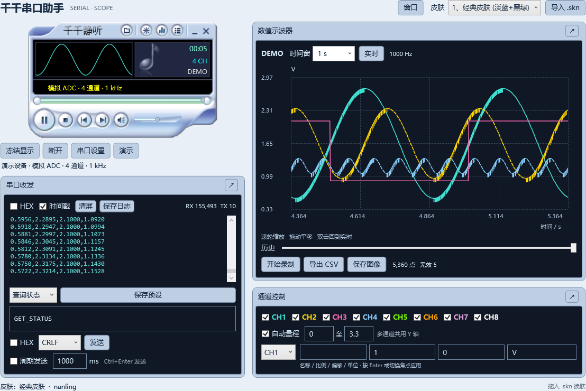
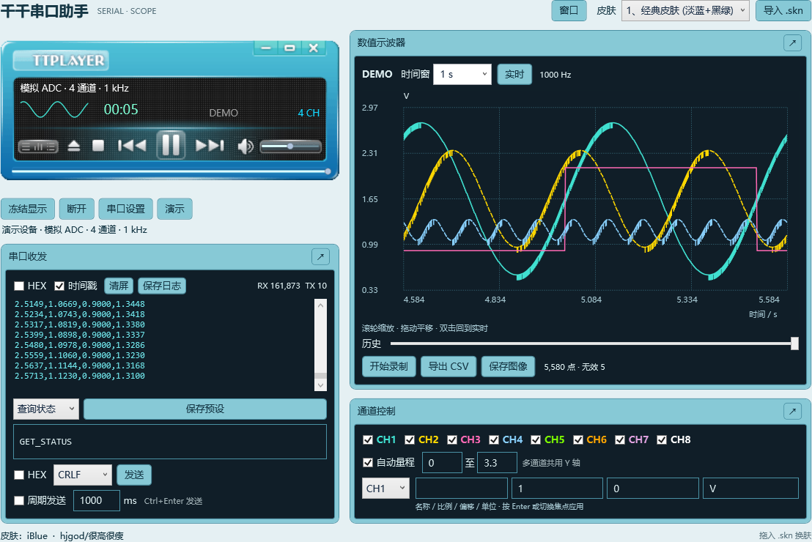
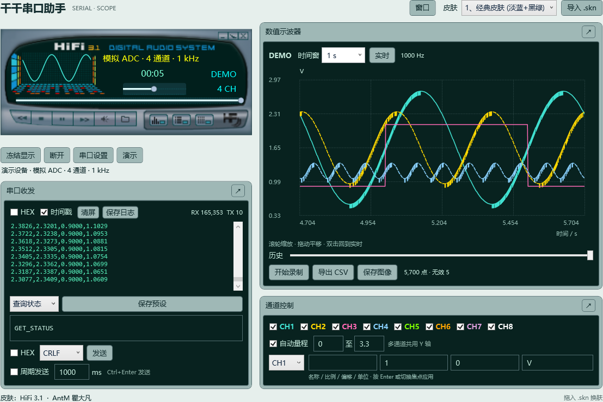

# 千千串口助手

C# / .NET 10 / WPF 实现的桌面串口工具。主面板使用千千静听原版 `.skn` 图片与控件坐标，收发、数值波形和通道窗口采用配套主题。经典、iBlue、HiFi 3.1 已做界面检查；另有 66 款皮肤通过格式解析和主窗口图片解码检查。

## 界面预览

以下为应用实际控件的渲染截图，波形使用四通道模拟 ADC 数据。

**经典皮肤**



**iBlue**



**HiFi 3.1**



## 运行

双击根目录的 **启动千千串口助手.cmd**，或运行 `publish\win-x64\TTPlayerSerialAss.exe`。发布目录为 Windows x64 自包含便携版，复制整个目录即可使用；不要只复制 EXE。

1. 没有设备时点击 **演示**，查看 1 kHz 四通道模拟 ADC 波形。
2. 接设备时点击 **串口设置**，选择 COM 口、波特率、数据位、校验、停止位与流控，点击应用，再点击 **开始监视**。切换端口或波特率前先断开。
3. 输入文本或 HEX，选择换行方式，点击发送。`Ctrl+Enter` 也可发送。HEX 直接发送输入的字节，不追加换行。
4. 周期发送使用勾选时的内容快照，修改内容后需重新勾选；周期最小 20 ms。断开或发生串口错误会停止周期发送。
5. 点击皮肤下拉框切换皮肤，或导入 / 拖入 `.skn`。导入文件复制到应用配置目录，不修改原始皮肤。

`GET_STATUS`、`READ_ADC`、`SET_RATE 1000` 是可编辑的预设示例，具体命令需与单片机固件一致。选择预设不会自动发送。

## 原版皮肤按钮映射

| 原播放器控件 | 串口助手功能 |
| --- | --- |
| 播放 / 暂停 | 开始监视 / 冻结显示 / 恢复显示 |
| 停止 | 断开串口 |
| 上一首 / 下一首 | 选择上一条 / 下一条发送预设 |
| 打开 | 串口与数值协议设置 |
| PL / LRC / EQ | 显示或隐藏收发 / 波形 / 通道窗口 |
| 进度条 | 冻结并定位当前历史 |
| 音量条 | 波形时间窗，0.01–120 秒 |
| 静音 | 开关串口错误提示音 |
| 迷你模式 | 切换紧凑主面板 |

没有某个原版按钮的皮肤，可使用文字按钮或“窗口”菜单。各功能面板右上角的 **↗** 可将面板浮动到独立窗口，关闭浮动窗口即归位。

## 单片机上传格式

默认每行 1–8 个数值、逗号分隔，以 `LF` 或 `CRLF` 结束。例如：

```text
1.23,2.34,0.98,3.10\r\n
1.24,2.35,0.99,3.09\r\n
```

这里的 `\r\n` 表示真正的换行字节。也可选择 TAB、分号、空白分隔；数值使用小数点 `.`，支持科学计数法。首个有效行确定通道数，本次连接中不应改变。若原始行有更多字段，可指定最多 8 个通道列号（从 1 开始，例如 `2,4,5`）。单行最长 8192 字节。

单片机 C 示例：

```c
// 将 printf 重定向到 UART；每次 ADC 采样后上传。
printf("%u,%u,%u,%u\r\n", adc[0], adc[1], adc[2], adc[3]);
```

通道换算：`工程量 = 原始值 × 比例 + 偏移`。例如 12 位 ADC、参考电压 3.3 V 时，可设比例为 `0.0008058608`（3.3 / 4095）、偏移 0、单位 V；实际比例应按硬件确定。CSV 始终导出原始数值，显示换算不更改采样数据。

时间轴有三种来源：

- **电脑到达时间**：同一串口读取批次的样本可能共用时间，适合查看趋势，不能作为精确采样时刻。
- **固定采样率**：输入固件实际上传的采样率，用样本序号推算时间；无效的非空行占一个时间槽，并在下一有效样本处断线。
- **首列设备时间 / ms**：例如 `1000,1.23,2.34`，第一列为单调递增的毫秒时间，其余列为数值。显示以首个时间为零点；时间回退或重复的行会被拒绝。设备复位、计数回绕后应重新连接。

串口实际吞吐取决于波特率与每行长度。演示数据在程序内生成，演示的 1 kHz 不代表 115200 baud 能传输同样长度的文本。

## 波形与保存

- 滚轮缩放时间轴，拖动平移，双击或点击“实时”回到最新数据；鼠标指向曲线显示采样值。
- 冻结仅暂停显示，后台接收和录制继续；冻结时的 CSV 导出使用冻结的历史快照。
- 最多 8 通道，支持开关、名称、单位、比例、偏移、自动 / 手动 Y 量程，多通道共用 Y 轴。
- 波形历史最多 **120,000 个采样时刻**；原始日志最多 **4 MiB**；可见文本有限长，超过后淘汰旧显示。长期保存请使用录制。
- **开始录制**会在所选目录创建独立会话文件夹：`wire.jsonl` 保存原始收发字节、方向和电脑时间；`samples.csv` 保存数值样本；`session.json` 保存协议与换算配置。停止或退出时排空写入队列。磁盘错误或队列满会停止录制并提示。
- **导出 CSV**保存当前历史，列为 `time_s,ch1,...,ch8,gap`，不足的通道留空；`gap=1` 表示该点前存在无效数据导致的断线。
- **保存日志**保存最近的原始字节，不受 HEX / 文本显示切换影响；**保存图像**导出当前波形 PNG。

配置位置：`%LOCALAPPDATA%\TTPlayerSerialAss\settings.json`；导入皮肤位于其 `Skins` 子目录。

## 开发与学习

使用 Visual Studio 2026 打开根目录 **TTPlayerSerialAss.sln**，将 **TTSerial.App** 设为启动项目，按 F5。

```powershell
dotnet build TTPlayerSerialAss.sln -c Release
dotnet run --project tests/TTSerial.Tests -c Release -- .
dotnet run --project src/TTSerial.App
```

以上命令在仓库根目录执行。运行 `tools\build.ps1` 生成便携版；运行 `tools\verify.ps1` 执行逻辑测试和 WPF 演示 / 图片检查。WPF 检查在后台执行，使用独立测试配置，不打开实体串口。

| 文件 / 项目 | 适合学习的内容 |
| --- | --- |
| `src/TTSerial.App/MainWindow.xaml` | WPF 布局、资源、样式与数据绑定 |
| `src/TTSerial.App/MainWindow.xaml.cs` | 按钮事件、异步操作、UI 定时刷新 |
| `src/TTSerial.App/SkinVisual.cs` | 位图、按钮状态、绘图与坐标映射 |
| `src/TTSerial.App/WaveformView.cs` | 曲线、按像素保留极值、缩放与鼠标测量 |
| `src/TTSerial.App/Session.cs` | 接收、缓冲、录制与 UI 队列 |
| `src/TTSerial.Core/SkinDocument.cs` | ZIP、旧 XML、GB18030、皮肤格式 |
| `src/TTSerial.Core/Samples.cs` | 拆包 / 粘包、数值协议、有界环形缓冲 |
| `src/TTSerial.IO` | 串口所有权、后台写盘、取消与关闭 |
| `tests/TTSerial.Tests` | 不依赖实体串口的功能测试 |

首版使用 WPF 自绘波形，刷新频率约 20 次/秒，与采样率独立。UI 事件集中在 code-behind，协议与 I/O 已独立拆分，后续可逐步重构为 MVVM。

## 当前边界

已验证模拟收发和软件流程；本机未检测到实体 COM 口，真实适配器的收发回环、端口占用、拔插及驱动兼容性仍需接硬件验证。尚未做 30 分钟高负载验收或全部 DPI 的外观验收。

首版保留原版主面板图片与按钮，辅助面板使用匹配主题的 WPF 布局。其余皮肤属于通用适配，尚未逐款精调；未实现原版所有辅助窗体的九宫格、磁性吸附、系统托盘、触发、双游标、FFT、二进制帧协议和录制回放。

收录的原版千千静听皮肤保留原始素材和作者信息。各皮肤的名称、作者及来源信息可在原始包的 `Skin.xml` 中查看。
